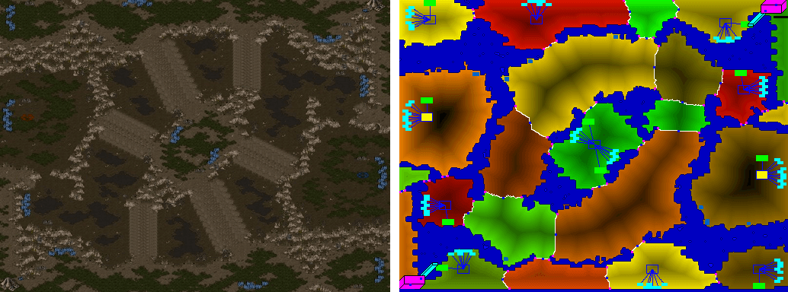

In this tutorial, we will develop a neural network model for building placement.
If you'd like to learn the basic ideas ideas around machine learning or neural networks first, we recommend [this course](https://course.fast.ai/ml) as an introduction to machine learning and [these](https://www.youtube.com/watch?v=bxe2T-V8XRs&list=PLiaHhY2iBX9hdHaRr6b7XevZtgZRa1PoU) [videos](https://www.youtube.com/playlist?list=PL3FW7Lu3i5JvHM8ljYj-zLfQRF3EO8sYv) for neural networks.

## Problem Description

In StarCraft, buildings are required for economic advancement such as the ability to gather resources or to produce specific unit types.
With from the overall decision **what** building to construct, the question of **where** to place it carries some strategic meaning.
Placement is crucial for e.g. [walling in](https://liquipedia.net/starcraft/Walling_as_Zerg) or for [Bunker](https://liquipedia.net/starcraft/Bunker_Rush) or [Cannon rushes](https://liquipedia.net/starcraft/Cannon_Rush).
For Protoss and Terran in particular, unit production buildings (in particular, [Barracks](https://liquipedia.net/starcraft/Barracks) and [Gateways](https://liquipedia.net/starcraft/Gateway)) placed in close proximity to the enemy base can be used to increase the pressure on the opponent in the early game.
For defense buildings, placement is important to ensure that worker units are protected or choke points are blocked.

Let's take a look at the [BuildingPlacer module](modules.md) that is used in CherryPi. 
Its input is a [UPCTuple](design.md) with a "Create" command and specified unit **type** (which is required to be a building).
The module will then refine the **position** distribution to a concrete location.
The actual construction will be performed by the [Builder module](modules.md); the BuildingPlacer module will however track this with a [proxy task](design.md) and perform re-tries with possibly different positions until the building is finally being constructed.

## Action Space Restrictions

For the sake of the tutorial, we will assume that building placement is independent of strategic decisions.
As discussed above, this is not the full story and a natural approach would be to learn all of the **when**, **what** and **where** of unit production jointly.
This would require more elaborate model and training setups and is hence considered outside of the scope of this example.

Generally, we assume that the placement has already been restricted (by the strategy module or the built-in placement rules) to a specific **area** as defined by [BWEM](http://bwem.sourceforge.net/), the map analysis tool used in TorchCraftAI.

The image above (credit to [http://bwem.sourceforge.net/](http://bwem.sourceforge.net/)) illustrates the concept of ares for a Brood War map.
In a nutshell, they represent coherent regions on a map which are connected via ramps or choke points (or not connected at all, e.g. islands).

To sum up, the input of our learned placement model will now be (apart from the current game state) a requested building type and a requested area.
The output will be a probability distribution over the whole map, with probabilities corresponding to a preference for placing the building at the respective location.
In the [reinforcement learning setup](bptut-rl.md) we will also make sure that the model can only produce non-zero probabilities at valid locations, i.e. locations that are both within the requested area and legal positions for the requested building.
