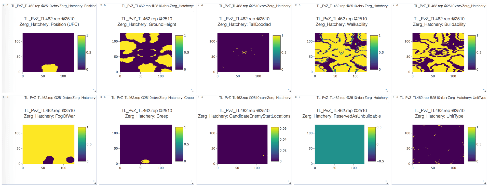
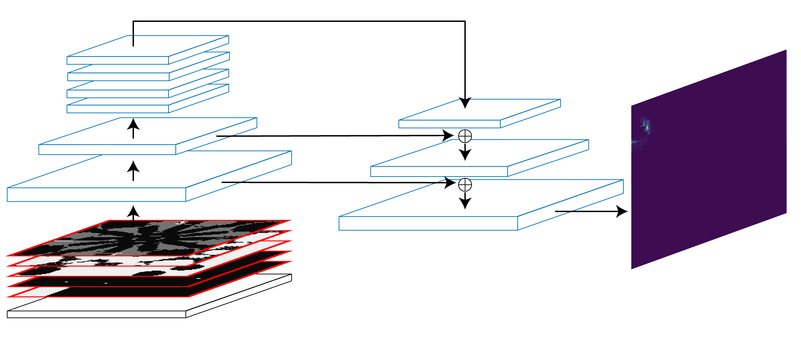

Here, we will provide a detailed description of the model we will use for building placement. In the later sections, we will then cover example setups for supervised and reinforcement learning.

As discussed in the [previous section](bptut-intro.md), our model should output probabilities for build locations.
In StarCraft: Brood War, three different resolutions are typically considered
when talking about locations: **pixels** (each point directly translates to a
visible pixel on the screen), **walktiles** (comprises 8x8 pixels) and **buildtiles** (each tile comprises 4x4 walktiles, e.g. 32x32 pixels).
As the name suggests, buildtiles correspond the resolution at which buildings
can be placed.
There are several rules that determine whether a location is valid for a given
building.
For example, consider the following situation:


The Brood War UI indicates which buildtiles can be used for a building and highlights them in green.
The red tiles cannot be used, e.g. if another unit is in the way (here, the Hatchery) or if the location is considered unbuildable (a cliff, for example).
There are further rules applying to individual buildings: Zerg buildings, with the exception of Hatcheries and Extractors, can only be placed on [creep](http://starcraft.wikia.com/wiki/Creep) which is shown in purple in the image above.

## Input

Naturally, our model needs to be informed of the requested building type.
We also want to provide it with an overview of the current state and with enough information about the map so that it can tell valid from invalid locations.
For good placement, we will require even more detailed map information such as walkability.
Ideally, the model could use this to detect ramps and choke-points and optimize defense building placement.

We will use the following features for the model -- all are provided in buildtile resolution.
The underlying data of these features is often in walktile resolution.
In this case, we will apply simple average pooling to obtain the buildtile resolution feature.
- **Type**:
  The requested build type as an integer corresponding to the [`torchcraft::BW::UnitType` enumeration](https://github.com/TorchCraft/TorchCraft/blob/ca34a171b1a498589a9e46d9c67974f1f3f98e25/include/constants.h#L469), which in turn corresponds to [`BWAPI::UnitTypes::Enum`](https://bwapi.github.io/namespace_b_w_a_p_i_1_1_unit_types_1_1_enum.html#a082c934b3011fe0df23c262311644989).
- **Position (UPC)**:
  This is the prior of the possible positions, which can be selected by a higher-level strategy module.
  In our setup, it is a binary map for which the destination area (see [previous section](bptut-intro.md)) is marked with 1.
- **GroundHeight**:
  Every walktile has a height value of either 0, 1 or 2.
- **Walkability**:
  Every walktile is either walkable (1) or not (0)
- **Buildability**:
  Every buildtile is either buildable (1) or not (0)
- **FogOfWar**:
  This is computed on buildtile level as well. If we currently don't have vision of a buildtile, it will be marked with 1.
- **Creep**:
  All tiles with creep are marked with 1.
- **CandidateEnemyStartLocations**:
  This feature marks all possible start locations for the opponent with 1.
  Common maps define either 2, 3 or 4 possible start locations.
  This feature will change if we found the enemy or scouted a start location and could determine that the opponent did not start at this position.
- **TallDoodad**:
  A "doodad" is a non-unit object on the map, for example a tree.
  They impact buildability and can be purposed for tactical decisions.
- **Units**:
  A list of all units that are currently alive.
  This includes allied units (i.e. our units), opponent units that we can observe and neutral units such as minerals or geysers.
  This is a sparse feature, represented as a simple list of unit types (with corresponding offsets per faction) and accompanying positions.

One complication here is that Brood War maps differ in size.
For competitive play, the maximum map size that is considered is 1024x1024 pixels, i.e. 128x128 buildtiles.
We make sure that our model always operates on a 128x128 input by zero-padding features for smaller maps.
For example, on ["Heartbreak Ridge"](https://liquipedia.net/starcraft/Heartbreak_Ridge), which is a 128x96 buildtile map, we would apply zero-padding of 16 buildtiles at the top and bottom of the input features.

The figure below is a plot of the above features in [Visdom](https://github.com/facebookresearch/visdom), extracted from a human game replay from the [StarData](https://github.com/TorchCraft/StarData) dataset.



## Output

The output of the model is a probability distribution over the whole map in
buildtile resolution, i.e. for each buildtile position, we obtain a probability
for placing the building at the specified position.
Similar to the input features, the output will always be a 128x128 tensor in buildtile resolution.

For the [reinforcement learning setup](bptut-rl.md), we place a mask on the output so that invalid locations will have zero probability.
This does not change the general nature of the output, however.


## Model Architecture

We select a [convolutional neural network](https://en.wikipedia.org/wiki/Convolutional_neural_network) (CNN) with a feature pyramid and lateral connections as our model.
This architecture is common in image processing and has been used successfully for [object detection](https://arxiv.org/abs/1612.03144), for example.



On the left of the figure above, input features are processed using convolutional neural networks with a striding of 2.
As a result, the 128x128 input will be transformed into a 64x64 and finally into a 32x32 pane of activations.
At this scale, information can easily be propagated across the full map by successively applying local filters, i.e. convolutional layers with a stride of 1.
Finally, on the right of the figure, upsampling layers with lateral connections are employed so that the output size of the network matches the input size.
A final softmax layer yields a probability distribution, visualized with a heatmap at the far right of the figure.

### Feature Integration

Most of the features listed above can be presented to the network as-is, i.e. as 128x128 tensors.
In contrast, unit information is supplied in a sparse manner for efficient processing.
In this model, a simple lookup table is used to embed the types of units on the map (both represented as one-hot vectors) into a low-dimensional space.
These embeddings are then placed at the positions of the units they represent.
If multiple units are located at the same buildtile, their embeddings are simply summed up.

The requested building type is integrated in a similar fashion; however, as there it does not relate to any position its embedding is simply replicated across the entire map.

The feature integration happens during the forward pass of the [BuildingPlacerModel](https://github.com/TorchCraft/TorchCraftAI/tree/master/src/models/buildingplacer.cpp).

```cpp
// Embed units and requested type
auto unitsT = embedU->forward({unitsData})[0].squeeze(2);
auto typeT = embedT->forward({type})[0];

// Place on 2D map. For now, handle each sample in the mini-batch individually
auto units2d =
    common::scatterSum2d(unitsPos, unitsT, {map.size(2), map.size(3)});
auto type2d = typeT.unsqueeze(2).unsqueeze(2).expand(
    {typeT.size(0), typeT.size(1), map.size(2), map.size(3)});

// Prepare input to convolutions
torch::Tensor x = at::cat(
    {map,
     units2d.to(map.options().device()),
     type2d.to(map.options().device())},
    1);

// Up the pyramid
x = at::relu(conv1->forward({x})[0]);
torch::Tensor outC1 = x;
x = at::relu(conv2->forward({x})[0]);
torch::Tensor outC2 = x;
x = at::relu(conv3->forward({x})[0]);
torch::Tensor outC3 = x;

// Through top convs
for (auto i = 0U; i < convS.size(); i++) {
  x = at::relu(convS[i]->forward({x})[0]);
}

// Back to original output resolution
x = common::upsample(x, common::UpsampleMode::Nearest, 2);
x = dconv2->forward({x})[0];
x = at::relu(x + skip2->forward({outC2})[0]);
x = at::relu(postskip2->forward({x})[0]);

x = common::upsample(x, common::UpsampleMode::Nearest, 2);
x = dconv1->forward({x})[0];
x = at::relu(x + skip1->forward({outC1})[0]);
x = at::relu(postskip1->forward({x})[0]);

torch::Tensor y = out->forward({x})[0].view({batchSize, -1});
```
