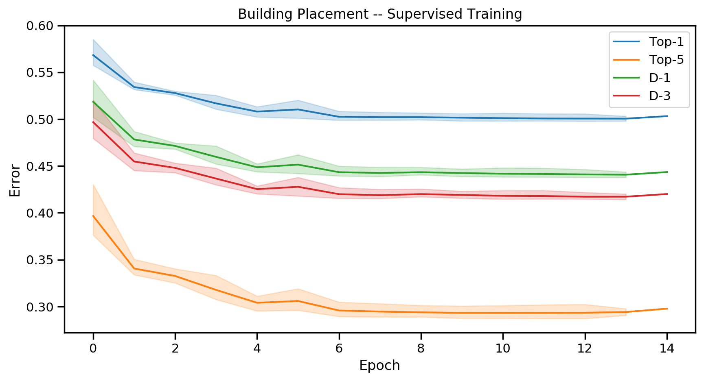

We validate the building placement model introduced in the [previous section](bptut-model.md) in a supervised setup, in which we aim to predict build locations selected by human players.
Utilizing the [StarData corpus](https://github.com/TorchCraft/StarData), we show that the model is able to generalize to new game situations by comparing it to a few simple baselines.

## Sample Extraction

First, we will need to extract the necessary training data from the relevant games in StarData.
We limit the discussion in this tutorial to building placement for Zerg even though the procedures described will work for any race.

Let's start by downloading and extracting the original replays of the StarData corpus using the [awscli](https://aws.amazon.com/cli/) command-line tool (note that the replays are a 5 GB download)
```sh
aws s3 cp --no-sign-request s3://stardata/original_replays.tar.gz .
tar xvzf original_replays.tar.gz
```

The sample extraction program ([collect-replay-samples](https://github.com/TorchCraft/TorchCraftAI/tree/master/scripts/building-placer/collect-replay-samples.cpp)) processes a set of Brood War replays and writes all relevant samples to disk.
As a first step, we load the replay using [bwreplib]() to gain access to game meta-data and all actions performed by the players.
From the meta-data, we can determine the player IDs matching the race that we are interested in:
```cpp 
  BWrepFile bwrep;
  if (!bwrep.Load(replayFile.c_str(), BWrepFile::LOADACTIONS)) {
    throw std::runtime_error("Cannot load replay: " + replayFile);
  }

  // We don't want to featrurize overly large maps
  if (bwrep.m_oHeader.getMapWidth() > BuildingPlacerSample::kMapSize ||
      bwrep.m_oHeader.getMapHeight() > BuildingPlacerSample::kMapSize) {
    VLOG(0) << "Skipping large map in " << replayFile << " ("
              << bwrep.m_oHeader.getMapWidth() << "x"
              << bwrep.m_oHeader.getMapHeight() << ")";
    return;
  }

  // We'd like to collect samples from every player who's playing the given
  // race.
  // There's some confusion in bwreplib regarding player indices and player
  // slots. The player ID of a specific action referes to the player's slot; for
  // the replay perspective, we have to use the actual IDs.
  std::vector<std::pair<int, PlayerId>> players;
  for (int i = 0; i < bwrep.m_oHeader.getLogicalPlayerCount(); i++) {
    BWrepPlayer player;
    bwrep.m_oHeader.getLogicalPlayers(player, i);
    // Race enums match between bwreplib and BWAPI
    auto playerRace =
        tc::BW::Race::_from_integral(static_cast<int>(player.getRace()));
    if (playerRace == race) {
      players.emplace_back(i, player.getSlot());
      VLOG(1) << "Found " << race._to_string() << " player in " << replayFile
              << ": " << player.getName() << " at " << i;
    }
  }
```

For sample extraction, we are going to replay the game so that we gain access to the actual game state from the perspective of the respective player.
However, the state we obtain during replay does not contain the **actions** performed by the players -- we merely observe the results.
We thus scan all the actions in the replay file and collect the ones that correspond to build commands. 
As we then replay the game, we can featurize the game state at the time the action was taken.

```cpp
struct BuildAction {
  FrameNum frame;
  BuildType const* buildType;
  Position pos;

  BuildAction(FrameNum frame, BuildType const* buildType, Position const& pos)
      : frame(frame), buildType(buildType), pos(pos) {}
};
```

```cpp
    std::vector<BuildAction> buildActions;
    auto& actionList = bwrep.m_oActions;
    // Collect all build actions performed during the game
    for (int i = 0; i < actionList.GetActionCount(); i++) {
      auto* action = actionList.GetAction(i);
      if (action->GetPlayerID() != playerSlot) {
        continue;
      }
      if (action->GetID() != BWrepGameData::eACTIONNAME::CMD_BUILD) {
        continue;
      }
      auto* params = static_cast<BWrepActionBuild::Params const*>(
          action->GetParamStruct());
      // Validate the the building ID is actually corresponding to the player
      // race
      if (tc::BW::data::GetRace[params->m_buildingid] != race._to_string()) {
        continue;
      }
      buildActions.emplace_back(
          action->GetTime(),
          getUnitBuildType(params->m_buildingid),
          Position(
              params->m_pos1 * tc::BW::XYWalktilesPerBuildtile,
              params->m_pos2 * tc::BW::XYWalktilesPerBuildtile));
    }
```

Now that we gathered all relevant player actions, we replay the game from the player's perspective and featurize the game state at the appropriate frame.
Keep in mind that not all build actions a player takes actually result in a building being constructed.
For example, at the start of the game players will often spam build actions.
The actions may also fail if the player runs out of resources before the building is started, or they may simply decide to cancel the action.
In our program, we make sure to only extract data for successful actions by validating that a unit with the respective building type actually appears.

```cpp
struct SampleCandidate {
  FrameNum frame;
  BuildingPlacerSample sample;
  bool verified;

  SampleCandidate(FrameNum frame, BuildingPlacerSample sample, bool verified)
      : frame(frame), sample(std::move(sample)), verified(verified) {}
}
```

```cpp
  while (actionIt != actions.end() && !state->gameEnded()) {
    replay.step();

    // Collect samples for any actions taken during step
    while (actionIt->frame <= state->currentFrame()) {
      // We assume we know the target area
      auto upc = std::make_shared<UPCTuple>();
      upc->position = state->areaInfo().tryGetArea(actionIt->pos);
      upc->state = UPCTuple::BuildTypeMap{{actionIt->buildType, 1}};

      BuildingPlacerSample sample(state, actionIt->pos, upc);
      candidates.emplace_back(state->currentFrame(), std::move(sample), false);
      VLOG(1) << "New sample at frame " << state->currentFrame() << ": build "
              << actionIt->buildType->name << " at " << actionIt->pos;

      if (++actionIt == actions.end()) {
        break;
      }
    }

    auto verify = [&](Unit* unit) {
      Position buildPos(unit->buildX, unit->buildY);
      for (auto it = candidates.rbegin(); it != candidates.rend(); ++it) {
        if (!it->verified && it->sample.action == buildPos) {
          it->verified = true;
          VLOG(1) << "Verified building " << utils::unitString(unit) << " at "
                  << Position(unit) << " placed at " << it->frame;
          break;
        }
      }
    };

    for (auto* unit : uinfo.getNewUnits()) {
      if (!unit->isMine || !unit->type->isBuilding) {
        continue;
      }
      verify(unit);
    }

    // For Zerg, worker units will morph into buildings
    for (auto* unit : uinfo.getStartedMorphingUnits()) {
      if (!unit->isMine || !unit->type->isBuilding ||
          !unit->type->builder->isWorker) {
        continue;
      }
      verify(unit);
    }

    // Refineries will not be present in getNewUnits() since they are
    // assigned to the geyser unit they are placed on. We thus keep track
    // of all refineries and run verify() for every new one. 
    if (refineryType) {
      for (auto* unit : uinfo.myUnitsOfType(refineryType)) {
        if (refineries.find(unit) == refineries.end()) {
          verify(unit);
          refineries.insert(unit);
        }
      }
    }
```

The collected samples will be serialized to disk using [Cereal](https://uscilab.github.io/cereal/).
[Zstandard compression](http://facebook.github.io/zstd/) is used to reduce the required disk space.
Here's an example output for our sample extraction script (with `-v 1`) when processing a game from StarData:

```sh
./build/scripts/building-placer/bp-collect-replay-samples /checkpoint/starcraft/stardata_original_replays/7/bwrep_twaw9.rep
I64624/XXXXX [collect-replay-samples.cpp:287] Found 37 build actions in /checkpoint/starcraft/stardata_original_replays/7/bwrep_twaw9.rep for player 1
I64624/XXXXX [state.cpp:438] Enemy: Manner]Stork. playing Zerg
I64624/XXXXX [state.cpp:442] Map: bwrep_twaw9.rep
I64624/XXXXX [state.cpp:443] Game is being played at LF2
I64624/XXXXX [state.cpp:438] Enemy: Maul[gGee] playing Protoss
I64624/XXXXX [state.cpp:442] Map: bwrep_twaw9.rep
I64624/XXXXX [state.cpp:443] Game is being played at LF2
I64624/XXXXX [collect-replay-samples.cpp:299] Wrote 16 samples to ./7/bwrep_twaw9_1/
```

As a final step, we partition the data into training, validation and test sets.
We follow the partitioning in [Lin et al.](https://arxiv.org/abs/1708.02139), which holds out 5% of replays for both validation and testing.

```sh
cd original_replays
find $(seq 0 17) -name '*.rep' > train.list
find 18 -name '*.rep' > valid.list
find 19 -name '*.rep' > test.list
find * -name '*.rep' > all.list
```

You can use your favorite method of parallel processing to extract the samples in parallel.
Here's an example using` xargs`:
```sh
# From the TorchCraftAI source directory
sed "s,^,$PATH_TO_ORIGINAL_REPLAYS/," $PATH_TO_ORIGINAL_REPLAYS/all.list \
| xargs -P $(nproc --all) \
   ./build/scripts/building-placer/bp-collect-replay-samples \
  -v 1 -race Zerg -output_path $OUTPUT_PATH
cd $OUTPUT_PATH
find $(seq 0 17) -name '*.bin' > train.list
find 18 -name '*.bin' > valid.list
find 19 -name '*.bin' > test.list
find * -name '*.bin' > all.list
```

Running sample extraction on the whole StarData corpus takes a lot of time (i.e. several days on a single computer) but can be parallelized heavily if you have access to multiple machines.

## Training Program

Our supervised training program ([train-supervised](https://github.com/TorchCraft/TorchCraftAI/tree/master/scripts/building-placer/train-supervised.cpp)) implements a standard loop for mini-batch gradient decent for minimizing a loss that may be expressed in pseudo-code as follows:
```none
repeat until convergence {
  foreach minibatch (x, y) in corpus {
    o = M_θ(y);
    l = loss(y, o);
    ∇ = backprop(l, θ)
    θ = optimize(θ, ∇)
  }
}
```

<p>
The building placement model is implemented with PyTorch's C++ API which takes care of both the forward and the backward (backprop) passes.
We select a negative log-likelihood loss, i.e. we treat the selection of a suitable location as a classification problem where each location on the 128x128 buildtile map corresponds to a single class (this results in 16384 classes).
Concretely, the loss is computed for a mini-batch size of \(N\), the flattened model output after softmax \(o\) and a target vector \(y\) containing ground-truth class indices as follows:
$$L(y, o) = \frac{1}{N} \sum_{n=1}^N o_{n,y_n}$$
</p>

<p>
For optimization, we use SGD with learning rate \(\alpha\) and momentum \(\beta\), which updates the model's parameters \(\theta\) using the gradients \(\nabla\) as follows:
$$
\begin{align}
v_t &= \beta v_{t-1} + (1 - \beta) \nabla \\
\theta &\leftarrow \theta - \alpha v_t
\end{align}
$$
</p>

In our setting, `repeat until convergence` is implemented via early stopping on the validation set: if the loss on the validation set increases, we decimate the learning rate by a factor of 10.
If the learning rate has been reduced three times, we stop the training loop.

There are a few additional implementation details in [train-supervised](https://github.com/TorchCraft/TorchCraftAI/tree/master/scripts/building-placer/train-supervised.cpp):
- We use TorchCraftAI's [DataReader](https://github.com/TorchCraft/TorchCraftAI/tree/master/common/datareader.h) class to efficiently load the extracted samples from disk and onto the GPU in background threads.
- TorchCraftAI's training library [libcpid](https://github.com/TorchCraft/TorchCraftAI/tree/master/cpid) provides primitives for distributed computation that are used to offer synchronous multi-GPU training.
- If requested, performance metrics, validation set samples and model predictions are plotted to a [Visdom](https://github.com/facebookresearch/visdom) instance.

We can train our model on the extracted samples as follows (for brevity, the logging prefixes have been removed from the output):
```
./build/scripts/building-placer/bp-train-supervised -sample_path $OUTPUT_PATH
Gloo rank: 0 running on host learnfair0485 and size 1
Training run started with 1 workers
==========================================
adagrad_lr_decay: 0
adam_amsgrad: false
adam_beta1: 0.90000000000000002
# And a lot of other prameters...
visdom_port: 8097
visdom_server: http://localhost
weight_decay: 0
==========================================
0/100 cum_loss:7.2175 cur_loss:5.5757 samples/s:396
0/200 cum_loss:6.2518 cur_loss:4.9251 samples/s:403
#
# after several epochs...
# 
valid 12/123656: loss:1.6346 top1:0.4984 top5:0.2873 d1:0.4388 d3:0.4152
valid 12/123656: loss:1.0201 top1:0.2841 top5:0.1463 d1:0.2383 d3:0.2238 for 8667 Zerg_Hatcherys
valid 12/123656: loss:2.2680 top1:0.6480 top5:0.4580 d1:0.5720 d3:0.5380 for 500 Zerg_Nydus_Canals
valid 12/123656: loss:2.2885 top1:0.7115 top5:0.3937 d1:0.6192 d3:0.5877 for 1397 Zerg_Hydralisk_Dens
valid 12/123656: loss:2.7676 top1:0.8457 top5:0.5391 d1:0.7402 d3:0.6992 for 512 Zerg_Defiler_Mounds
valid 12/123656: loss:2.8183 top1:0.8315 top5:0.5391 d1:0.7413 d3:0.7076 for 831 Zerg_Queens_Nests
valid 12/123656: loss:2.5533 top1:0.7591 top5:0.4649 d1:0.6890 d3:0.6520 for 2138 Zerg_Evolution_Chambers
valid 12/123656: loss:2.8015 top1:0.8643 top5:0.5905 d1:0.7638 d3:0.7437 for 398 Zerg_Ultralisk_Caverns
valid 12/123656: loss:2.0783 top1:0.6684 top5:0.3351 d1:0.5824 d3:0.5624 for 1698 Zerg_Spires
valid 12/123656: loss:1.3006 top1:0.5365 top5:0.1712 d1:0.3816 d3:0.3468 for 2272 Zerg_Spawning_Pools
valid 12/123656: loss:2.5690 top1:0.7745 top5:0.4829 d1:0.7093 d3:0.6726 for 10082 Zerg_Creep_Colonys
valid 12/123656: loss:0.0054 top1:0.0028 top5:0.0003 d1:0.0028 d3:0.0028 for 5716 Zerg_Extractors
Validation loss stagnating, lowering learning rate to 1e-05
```


## Evaluation

We evaluate the model's performance using several metrics:
- **Top-1 Error:** This is the classification error, i.e. the fraction of samples for which the model produced a wrong prediction according to the `argmax` of its output.
- **Top-5 Error:** The fraction of samples for which the true output was not among the top five predictions of the model.
- **D-1 Error:** In many situations, missing the true location by a small margin is not too bad. Hence, this metric represents the fraction of samples for which the top prediction is not in a 3x3 buildtile square centered at the true location.
- **D-3 Error:** The fraction of samples for which the top prediction is not within a 9x9 buildtile square centered at the true location.

Here are plots during training (for Zerg) that show the loss and the above metrics over 3 training runs:




### Nearest Neighbor Baselines

When we look at the performance achieved by the trained model in isolation, we cannot judge whether the model is actually good, or how difficult the placement task is in general.
One way to gain insights here is to evaluate the performance of simpler **baseline** algorithms; here, we'll focus on a [nearest neighbor](https://en.wikipedia.org/wiki/K-nearest_neighbors_algorithm) baseline, implemented in [nn-baseline](https://github.com/TorchCraft/TorchCraftAI/tree/master/scripts/building-placer/knn-baseline.cpp).

The idea is conceptually simple: for a given sample from the validation set, we look up the closest neighbors in the training set and then use their locations as predictions.
We perform the selection of neighboring examples in two stages:

1. Retrieve relevant training samples by filtering.
We are interested in all actions that took place on the same map and in the same
area, and are placements of the same building type as the given validation sample.
2. Compute a distance measure between relevant training samples from the validation sample.
Afterwards, our prediction will be a list of locations from the relevant training samples, sorted by their distance.

We consider several distance measures:
- Cumulative distance between all buildings of similar type in the respective area.
This is a crude measure of "similarity" between game situations and also requires us to only consider training samples with the same composition of buildings as the validation sample.
- The L2 distance between the output of a randomly initialized building placement model for both samples.
This allows us to judge the [inductive bias](https://en.wikipedia.org/wiki/Inductive_bias) that we introduced by selecting our specific model architecture. 
- The L2 distance between the output of a trained model.
- An "oracle" baseline that has access to the actual location of the validation sample and ranks relevant training samples by their distance.
This method is of course cheating, but it provides an upper limit for algorithms that merely memorize the training data.

The results can be summarized in a histogram plot where we break down the metrics to individual building types:

Here's an example running the baseline script using the oracle distance metric (this can be sped up with the `-num_data_threads`, `-num_train_threads` and `-num_valid_threads` arguments).
Again, we removed the glog prefixes from the output.
```
./build/scripts/building-placer/bp-knn-baseline -sample_path $OUTPUT_PATH -distance_feature oracle
==========================================
distance_feature: oracle
filter_buildings: true
gpu: true
map: -1
map_spec: scripts/building-placer/stardata_rep_map.json.zst
model_path:
num_data_threads: 1
num_train_threads: 1
num_valid_threads: 1
sample_path: $OUTPUT_PATH
seed: -1744747180
similarity_metric: l2
==========================================
Building database of reduced training set samples
1 samples
100001 samples
200001 samples
# ... 
Collected data from 608709 samples
Scoring validation set
1 samples
10001 samples
20001 samples
valid 1/1: loss:0.0000 top1:0.3931 top5:0.3931 d1:0.2907 d3:0.2316
valid 1/1: loss:0.0000 top1:0.2078 top5:0.2078 d1:0.1595 d3:0.1246 for 8667 Zerg_Hatcherys
valid 1/1: loss:0.0000 top1:0.7820 top5:0.7820 d1:0.6420 d3:0.5700 for 500 Zerg_Nydus_Canals
valid 1/1: loss:0.0000 top1:0.5784 top5:0.5784 d1:0.4030 d3:0.3042 for 1397 Zerg_Hydralisk_Dens
valid 1/1: loss:0.0000 top1:0.8711 top5:0.8711 d1:0.7422 d3:0.6445 for 512 Zerg_Defiler_Mounds
valid 1/1: loss:0.0000 top1:0.7653 top5:0.7653 d1:0.5752 d3:0.4477 for 831 Zerg_Queens_Nests
valid 1/1: loss:0.0000 top1:0.7348 top5:0.7348 d1:0.5636 d3:0.4514 for 2138 Zerg_Evolution_Chambers
valid 1/1: loss:0.0000 top1:0.9121 top5:0.9121 d1:0.8317 d3:0.7337 for 398 Zerg_Ultralisk_Caverns
valid 1/1: loss:0.0000 top1:0.4305 top5:0.4305 d1:0.2998 d3:0.2362 for 1698 Zerg_Spires
valid 1/1: loss:0.0000 top1:0.1290 top5:0.1290 d1:0.0779 d3:0.0673 for 2272 Zerg_Spawning_Pools
valid 1/1: loss:0.0000 top1:0.5789 top5:0.5789 d1:0.3993 d3:0.3022 for 10082 Zerg_Creep_Colonys
valid 1/1: loss:0.0000 top1:0.1004 top5:0.1004 d1:0.1004 d3:0.1004 for 5716 Zerg_Extractors
```
