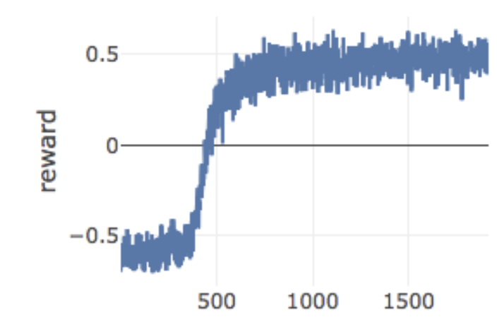
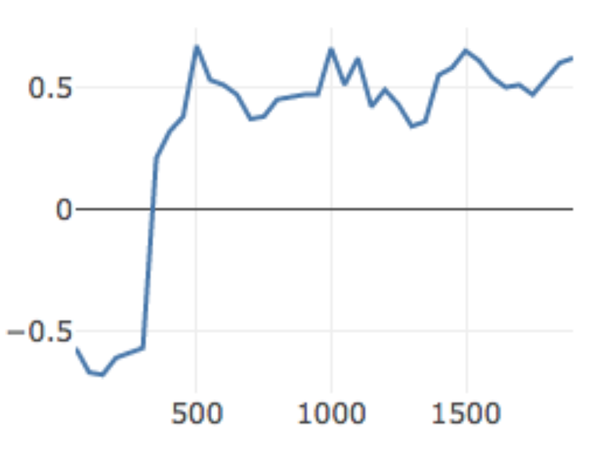
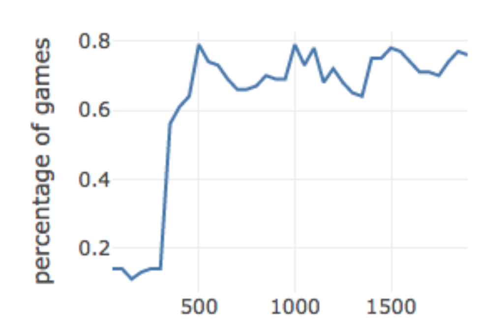

In this tutorial, we will develop a neural network model for using the three powerful abilities of Defilers. If you'd like to learn the basic ideas around machine learning or neural networks first, we recommend you to watch first some general resouses.

# Problem Description
In StarCraft, [the Defiler](https://liquipedia.net/starcraft/Defiler) is one of the Zerg's most powerful spell casters. A support unit, it is most well-known for its Dark Swarm and Plague abilities. A proper usage of these abilities can have a huge impact in the battle especially can allow low tech units like [Zerglings](https://liquipedia.net/starcraft/Zergling) to fight more effectively against ranged units like Marines. 
In this example, we are interested in these spells,

1. Dark Swarm
* Effects
It casts an orange cloud on the map under which no units take direct damage from most ranged attacks or workers.
* Heuristic Usage
If our army is composed with Zergling、Ultralisk, we should cast it to the enemy side (Marine, Ghost, Hydra, Dragon) to cover its range attack unit.
If Our army is Hydra, we should cast it in front of the enemy to only cover our side.
It doesn't protect buildings, so can cover the enemy buildings. (Bunker, Canon)

2. Plague
* Effects
It casts red toxic spores on units within the effect radius. These units subsequently begin to take 4 damage per second, ignoring armor, until a total of 300 Hit Points is lost or until the unit's health falls to 1-3 Hit Points.
* Heuristic Usage
Plague won't superimpose each other, we should cast one after another
We can use it when our army is hidden in the ground
Efficient against Carrier, Battlecruiser

3. Consume
* Effects
Sacrifices a friendly Zerg unit, taking its life and giving the Defiler 50 more energy.
* Heuristic Usage
No matter which unit we consume, the effects are the same, the same, so we should only consume inexpensive units like Zerglings.

In our case, We will add several new scenarios to micro trainings, you are welcome to finish [Micro Tutorial](#MicroTutorial) first before you take a look at this one, since this one can be considered as an add-in to its existing training loop.

# Action Space
In order to simplify this problem so we can solve it with a simple model, we set the following restrictions:
1. The model only controls the casting of Dark Swarm and Plague

2. The action space is the whole map at build tile resolution. The map is divided into 64 * 64 blocks, the defiler can cast into any of these blocks - after walking closer if needed.

3. Consume is rule based, it will consume to get enough energy ( as the rule requires ).

# Scenario Setup
## Simple Scenarios
Before using the defiler in the full game, we first test the defiler on micro scenarios. In this set of scenarios, we have only zerglings, defilers, siege tanks. The zerglings are supposed to travel a distance and then attack the tanks. This is a perfect scenario for using Dark Swarm since tank can only cause range damage, and they have no ways to attack the units around it. We would expect the defiler to create a Dark Swarm tunnels for the zerglings to cross.
In this case, we refill the defiler's energy three times for casting three Dark Swarms in row.

## Full Game Scenarios
We wanted to train our CherryPi bot (https://torchcraft.github.io/TorchCraftAI/docs/overview.html) to use Defilers in full games. But using full games to train those skills would be slow. Defilers usually don’t appear in the first ten minutes of a game; many games are won or lost before they appear, or a player already has a significative advantage. So most of the time spent playing games wouldn’t be helpful for training an agent to control Defilers.

We wanted to try something new: Training an agent to control Defilers in combat scenarios using our micro trainer, then evaluating that agent in complete games. By training in short scenarios (a few seconds long) using states that are already relevant (saving ten-plus minutes of gameplay), we could achieve much better wall-clock efficiency. It’d also be an interesting exercise to see if this approach could be applied to learning other skills in StarCraft more efficiently.

### Scenario Snapshotting
Full games pose a broad range of game states that Defiler-controlling agents need to address. Although the TorchCraftAI micromanagement trainer lets us construct any number of scenarios by hand, we didn’t think we could match the diversity of real games.

In order to train an agent that’s likely to generalize to full games, we created a pool of 100,417 scenarios based on snapshots of real games from StarData (https://github.com/TorchCraft/StarData) and from running CherryPi against a battery of opponents. We replayed games to identify states where a player had Defilers in proximity to an enemy army. We omitted states where one side had an overwhelming advantage. Finally, we recorded information about the map, unit types, and unit positions, which lets us programmatically regenerate those game states on the fly using OpenBW’s ability to spawn units on command.

# Experiments
## Simple Scenarios
### Baselines
* Noops : where the defilers do nothing
* Rule : where the defiler cast uniformly to according to stance from zerglings to the tanks.
* ML: where the action is sampled from the model

We define the reward here to be a protect zerglings reward. Which is give by the ratio of enemies eliminated minus ratio of lost zerglings during the episode.
$$ \frac{{enemies}_{max} - enemies}{{enemies}_{max}} - \frac{{zerglings}_{max} - zerglings}{{zerglings}_{max}} $$
We use this reward in order to prevent the defiler from moving to the corners to save itself and converges to local minimal.
We set our scenarios to be 3 tanks versus 4 zerglings, so we have enough space for improvement as well as a prove of concept by rule based behavior.

| Baseline | Win Rate | Reward |
|--|--|--|
|Noops | 0.070 | -0.650	|
|Rule | 0.571 |  -0.200 |

### Approach
We apply evolution strategy to this problem.

### Result 
The result is reported by reward / number of updates. Therule baseline as we shown before is at -0.2 for reward and0.5 for Win Rate. Our approche achieves much better resulton the scenarios than the no-ops and rule baseline.

