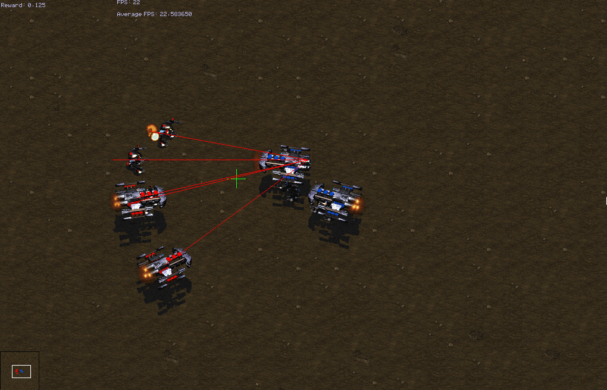
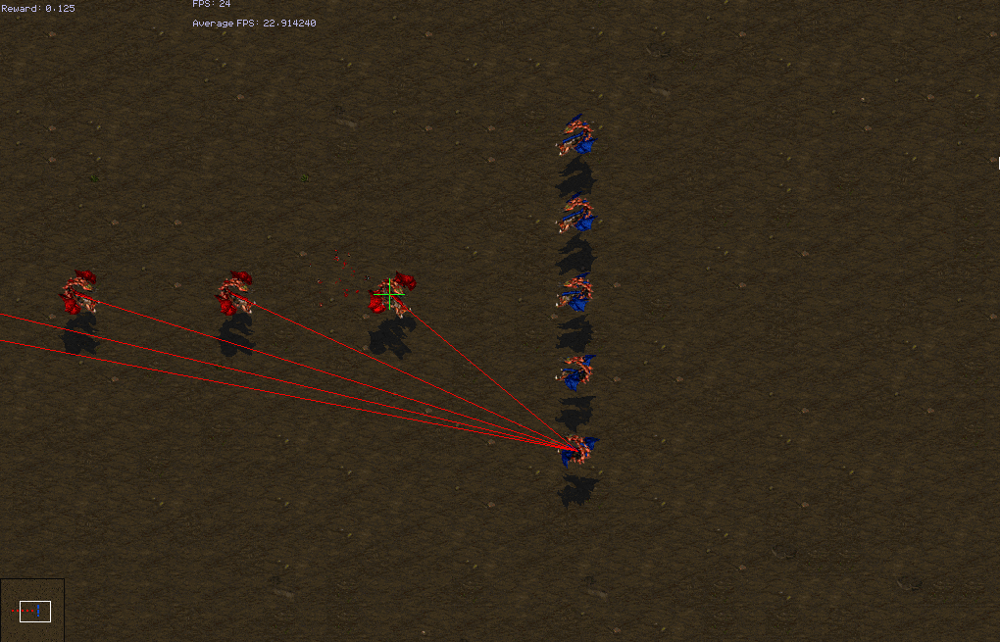
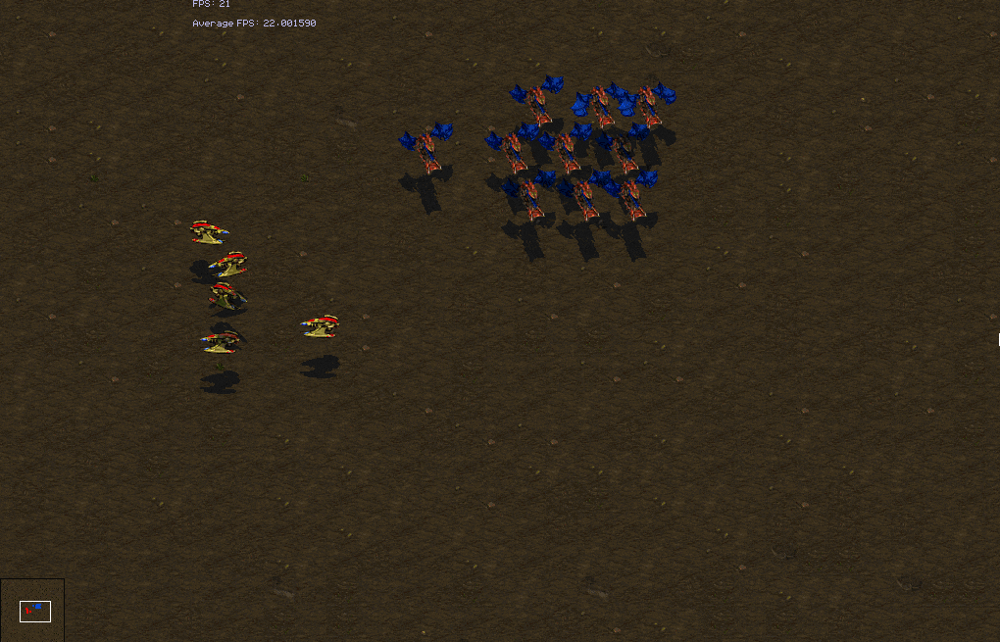
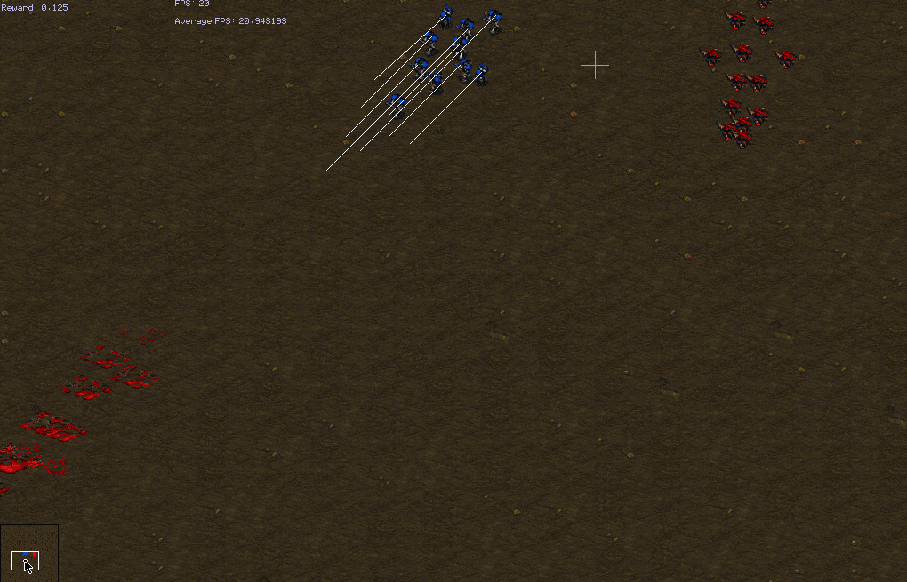
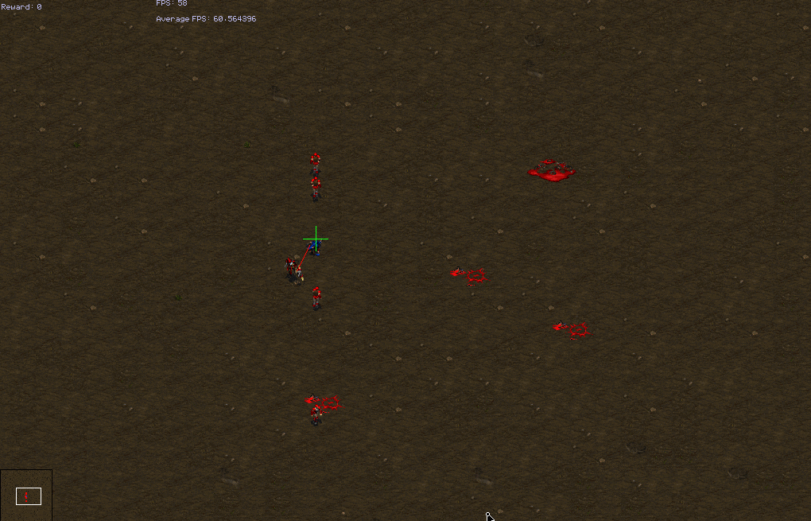

We train the model introduced in the [previous_section](microtut-model.md) using Evolution Strategies.
To make training more feasible, we choose to do some reward shaping to encourage our model to learn.
We show that we are able to learn interesting behaviors in a variety of different situations.
To try some of these yourself, check out how the model learns to spread units out in the 10mu_5co scenario, or how it learns to kite in the 1vu_1zl scenario.

## Evolution Strategies

[Evolution Strategies](https://blog.openai.com/evolution-strategies/) (ES) are a lightweight, scalable, gradient-free optimization technique. In the TorchCraftAI micro training, we use ES to optimize the weights of the micromanagement policy network.

Here's how ES works in the micro trainer:
* Initialize the policy network \\(\theta\\).
* Randomly perturb the network weights. Here we use [antithetic sampling](http://citeseerx.ist.psu.edu/viewdoc/download;jsessionid=A64D1AE8313A364B814998E9E245B40A?doi=10.1.1.180.7104&rep=rep1&type=pdf) to speed up convergence
* Run episodes with the perturbed weights and measure the associated rewards.
* Sort (rank) the rewards, then remap them to equally distributed values along [-0.5, 0.5].
* Weigh the perturbations by the ranked-and-normalized reward.
* Modify the network weights by the sum of the weighted perturbations.

Mathematically, we do the following steps in a loop:
1. Generate some noise vectors \\(\delta_i\\), where \\(i=1, \ldots, n\\). To do antithetic sampling, let's say \\(\delta_{2i+1} = -\delta{2i}\\).
1. Obtain the reward \\(r_i\\) for \\(n\\) battles using model \\(\theta + \alpha \delta_i\\). \\(\alpha\\) is `-sigma` in the codebase.
1. Calculate the reward transform, we use a rank transform like \\(t(r_i) = \frac{\mathrm{rank}(r_i)}{n}\\).
1. Find the parameter update, \\(\theta \leftarrow \theta + \eta t(r_i) \delta_i\\). \\(\eta\\) is the learning rate `-lr` in the codebase.

The ES trainer itself is in `cpid/estrainer.cpp`. The hyperparameters are command flags specified in `flags.h`.

## Reward Shaping

Scenarios come with customizable reward functions specified in `reward.cpp`. We have found this formula effective:

`Reward = (win=1, loss=0)/2 + (ratio of enemies killed)/4 + (ratio of friendly units surviving)/8 + ratio of enemy HP depleted)/16`

This reward gives 0.5 for a win. 
0.25 (1/4) is given proportionally according to the ratio of enemies killed.
0.125 (1/8) is given if all our units survive, and finally, 0.0625 (1/16) is given depending on the ratio of damage dealt to enemies.
This reward essentially tries to state that comparatively, two games that are both wins will break the tie in a way that encourages enemies killed, then allies surviving, then damage dealt.

By experimenting with the shapes in `reward.cpp` you may come up with something even better.

## Results

We trained the default parameters on a variety of scenarios.
We took the model with the highest train-time reward, and tested it on 100 battles and recorded the win rates.
These numbers are not tuned at all, but could serve as an interesting baseline on how easy each of the scenarios are, or what you should expect to see from training.
You can also notice how the choice of opponents can greatly affect the results of training in that scenario.
The striking example is that the attack-weakest first heuristic does terribly in large battles, where as attack move is quite strong in most large battle settings - the difference between 100% and 0% winrate in most large battle scenarios.

Additionally, our initial tutorial provides plenty of space for improvement.
Many of these scenarios are not solved, though since they are mirror matches, they should be easy for the expert human.
We encourage you to play with the model and setup on these tasks, and see how far you can get!

The name of the scenario is the exact string to pass to `-scenario`.
Here are again the abbreviations we use:

- ar - Archon 
- bc - Battlecruiser 
- co - Corsair 
- de - Devourer 
- dn - Drone 
- dr - Dragoon 
- fi - Firebat 
- go - Goliath 
- hy - Hydralisk 
- it - Infested_Terran 
- mr - Marine 
- mu - Mutalisk 
- pr - Probe 
- sc - Scout 
- st - Siege_Tank_Tank_Mode 
- sv - SCV 
- ul - Ultralisk 
- vu - Vulture 
- wr - Wraith 
- zg - Zergling 
- zl - Zealot 

Here are the results of training our model on a variety of scenarios:

### Symmetric scenarios

These are basicaly scenarios that are guaranteed to be balanced.
Several of the scenarios with 2 unit types rely on focus firing down one of the types first.

| Test Win Rates | weakest-closest  |  closest  |  attack-move |
|---:|:---:|:---:|:---:|
|ar|0.41|0.50|0.50|
|ar+sc|0.84|0.86|0.76|
|bc|0.36|0.89|0.75|
|big_ar|1.00|0.00|0.00|
|big_dr|0.91|0.00|0.00|
|big_fb|0.99|0.00|0.00|
|big_gh|0.97|0.19|0.00|
|big_go|0.80|0.00|0.13|
|big_hy|1.00|0.00|0.00|
|big_it|1.00|1.00|1.00|
|big_mr|0.93|0.09|0.00|
|big_pr|1.00|0.00|0.00|
|big_sv|1.00|0.00|0.00|
|big_st|0.93|0.08|0.29|
|big_ul|0.00|0.00|0.00|
|big_vu|1.00|0.00|0.00|
|big_wr|1.00|0.54|0.08|
|big_zg|1.00|0.00|0.00|
|big_zl|0.97|0.00|0.00|
|co|0.28|0.58|0.52|
|de|0.00|0.00|0.00|
|dn|0.27|0.22|0.57|
|dr|0.45|0.61|0.48|
|dr+sc|0.20|0.57|0.61|
|fi|0.54|0.24|0.23|
|go|0.39|0.72|0.66|
|go+bc|0.99|0.81|0.89|
|go+wr|0.66|0.63|0.76|
|hy|0.43|0.66|0.65|
|hy+mu|0.19|1.00|0.93|
|it|0.99|1.00|1.00|
|mr|0.17|0.33|0.43|
|mr+wr|0.39|0.61|0.52|
|mu|0.28|0.89|0.91|
|pr|0.14|0.33|0.54|
|sv|0.29|0.10|0.42|
|st|0.45|0.77|0.56|
|ul|0.32|0.57|0.50|
|vu|0.22|0.48|0.67|
|wr|0.43|0.49|0.63|
|xzl+ydr_xzl+ydr|0.24|0.08|0.13|
|zg|0.20|0.13|0.28|
|zl|0.30|0.29|0.25|

### Formation based scenarios

These formation based scenarios ideally involve the units grouping before fighting.
However, a few of them can achieve good winrrates with good focus fire.
Our model is not able to learn the regrouping tactic.

| Test Win Rates | weakest-closest  |  closest  |  attack-move |
|---:|:---:|:---:|:---:|
|conga_ar|0.47|0.69|0.03|
|conga_dr|0.00|0.00|0.01|
|conga_fb|0.24|0.11|0.47|
|conga_mr|0.29|0.43|0.69|
|conga_mu|0.24|0.99|0.79|
|conga_pr|0.74|0.01|0.88|
|conga_sv|0.52|0.00|0.29|
|conga_ul|0.20|0.09|0.00|
|conga_zg|0.00|0.03|0.64|
|conga_zl|0.04|0.04|0.00|
|surround_ar|0.67|0.53|0.32|
|surround_dr|0.08|0.01|0.64|
|surround_fb|0.59|0.22|0.10|
|surround_mu|0.24|0.85|0.90|
|surround_pr|0.06|0.01|0.52|
|surround_sv|0.22|0.01|0.28|
|surround_ul|0.25|0.04|0.12|
|surround_zg|0.02|0.00|0.00|
|surround_zl|0.12|0.01|0.05|

### Asymmetric scenarios

Many of these scenarios rely on kiting to defeat a slower, melee ranged opponent. 
A few rely on spreading units apart to avoid splash damage.

| Test Win Rates | weakest-closest  |  closest  |  attack-move |
|---:|:---:|:---:|:---:|
|10mr_13zg|0.90|0.90|0.97|
|10mu_5co|0.90|0.88|0.92|
|15mr_16mr|0.06|0.00|0.00|
|15wr_17wr|0.30|0.00|0.00|
|1dr_1zl|1.00|1.00|1.00|
|1dr_3zg|0.31|0.55|0.75|
|1go_2zl|0.00|0.00|0.00|
|1mu_3mr|0.00|0.00|0.00|
|1st_2zl|0.96|1.00|0.95|
|1vu_1hy|0.76|0.72|0.93|
|1vu_1zl|1.00|1.00|0.98|
|1vu_3zg|0.97|0.99|0.95|
|2dr+3zl_2dr+3zl|0.46|0.28|0.50|
|2dr_3zl|0.66|0.81|0.14|
|2hy_1sst|1.00|1.00|1.00|
|2mr_1zl|0.03|0.03|0.00|
|2vu_7zg|0.98|1.00|0.92|
|30zg_10zl|1.00|1.00|1.00|
|3dr_10zg|0.00|0.00|0.00|
|3go_8zl|0.00|0.00|0.00|
|3hy_2dr|0.01|0.10|0.01|
|3mr_3mr|0.36|0.64|0.64|
|3mu_9m3|0.00|0.00|0.00|
|3st_7zl|0.56|0.95|0.89|
|3vu_11zg|0.97|0.99|0.99|
|3vu_3hy|0.56|0.14|0.00|
|4hy_2sst|0.00|0.00|0.00|
|5mr_5mr|0.34|0.47|0.45|
|5mu+20zg_5gl+5vu|0.93|0.85|0.75|
|5vu_10zl|0.04|0.00|0.01|
|5wr_5wr|0.39|0.47|0.76|
|6mr_4zl|0.00|0.00|0.00|
|7zg_2gl|0.00|0.07|0.13|
|8mu_5co|0.10|0.21|0.10|
|vu_zl|0.28|0.35|0.01|

### Other scenarios

These scenarios do not involve combat.
The rewards are specifically tailored to the scenario.
In all of the `hug*` scenarios, the reward is negative distance.
In popoverlords, the reward is -1 for how long it took to kill all overlords.
In ignorecivilians, the reward is 1 for a perfect success, and between 0-1 for each civilian we kill.
We can see the model focuses the high templar, but isn't able to learn to completely ignore all civilians.
One tactic we observed is that the model would oscillate between two civilians so it never managed to kill any.

| Scenario | Test reward |
|---:|:---:|
|hugmiddle|-21.24|
|hugmiddleeasy|0.00|
|hugoverlords|-37.18|
|ignorecivilians|0.88|
|popoverlords|-5986.96|
